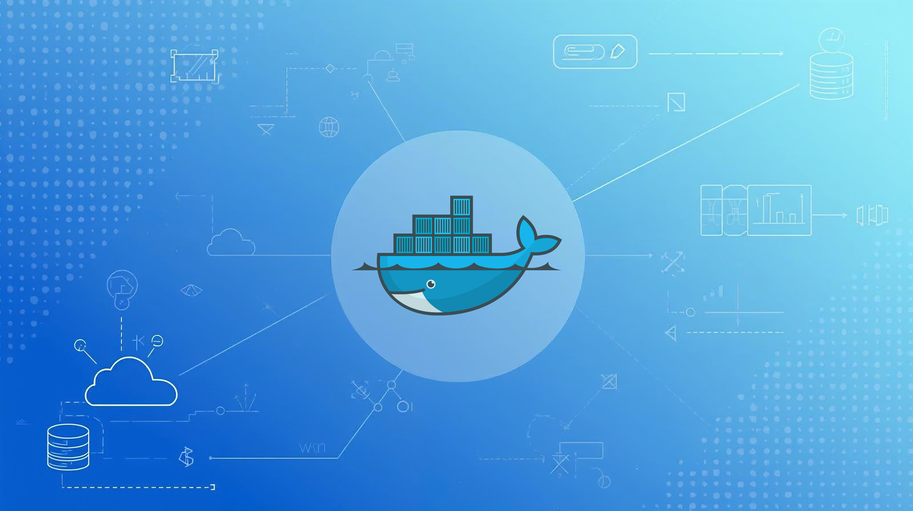
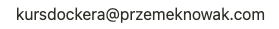

# [Docker od podstaw - dla programistów i nie tylko](https://www.udemy.com/course/docker-od-podstaw-dla-programistow-i-nie-tylko/?referralCode=39F9BBE841432712F0F4)

> Aktualizacja 2026

Hej,

materiały tutaj zawarte dotyczą kursu ["Docker od podstaw - dla programistów i nie tylko dostępnego na Udemy"](https://www.udemy.com/course/docker-od-podstaw-dla-programistow-i-nie-tylko/?referralCode=39F9BBE841432712F0F4).

W razie zainteresowania kursem zapraszam na stronę Udemy lub kontakt pod adresem:

Jeżeli zakupiłeś kurs lub korzystałeś z materiałów zachęcam do kliknięcia na [⭐ Star] 😉

Zobacz też moje inne kursy:

[Kubernetes od podstaw — dla programistów i nie tylko](https://www.udemy.com/course/kubernetes-od-podstaw-dla-programistow-i-nie-tylko/?referralCode=4AB1DB66CD8879CF5F4B)

[Claude Code w pigułce — dla programistów i nie tylko](https://www.udemy.com/course/claude-code-w-pigulce-dla-programistow-i-nie-tylko/?referralCode=61BDE20E46F94B0387A9)