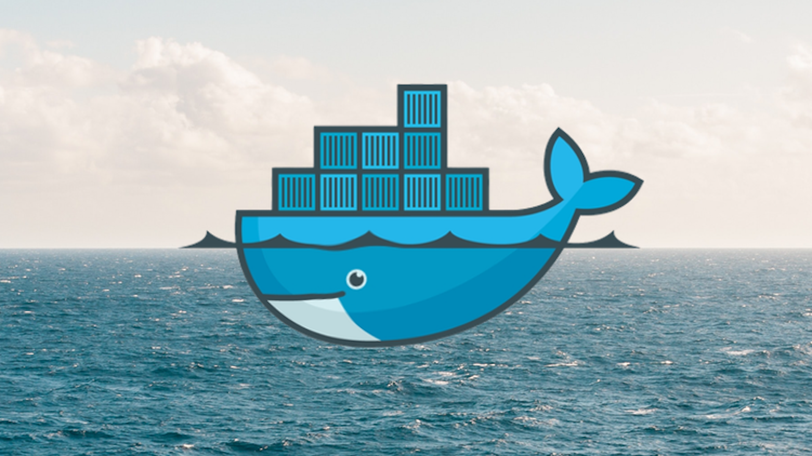

# [Docker od podstaw - dla programistów i nie tylko](https://www.udemy.com/course/docker-od-podstaw-dla-programistow-i-nie-tylko/?referralCode=39F9BBE841432712F0F4)

> Aktualizacja 2023

Hej,

materiały tutaj zawarte dotyczą kursu ["Docker od podstaw - dla programistów i nie tylko dostępnego na Udemy"](https://www.udemy.com/course/docker-od-podstaw-dla-programistow-i-nie-tylko/?referralCode=39F9BBE841432712F0F4).

W razie zainteresowania kursem zapraszam na stronę Udemy lub kontakt pod adresem:

Jeżeli zakupiłeś kurs lub korzystałeś z materiałów zachęcam do kliknięcia na [ ☆ Star] ;)